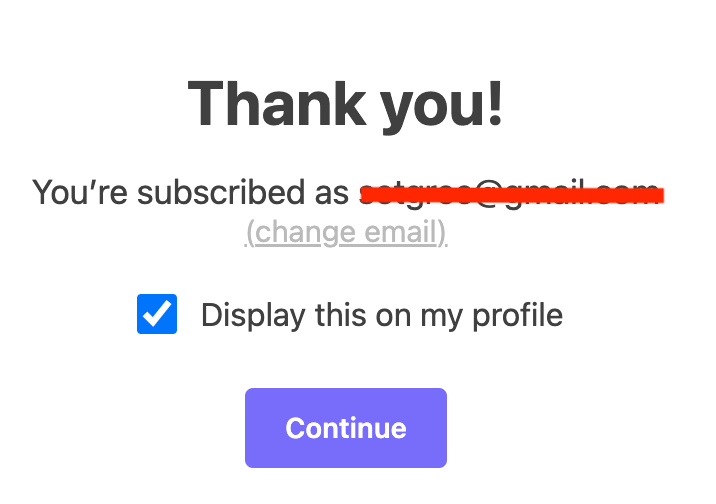
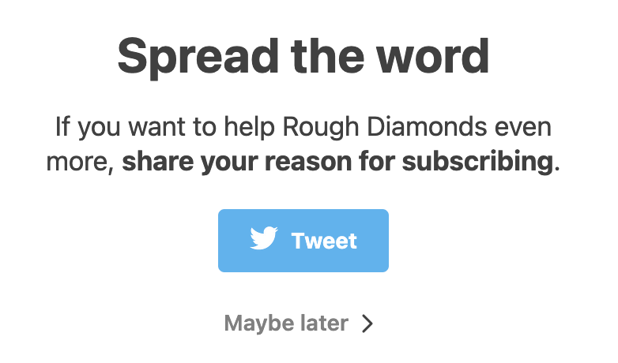

A lot of writers I like have moved to Substack. 

I presume that some of them are doing it for a big payday, e.g. Danny Lavery was kind enough to tell the _Times_ that his [2-year Substack contract was worth $430,000 ](https://www.nytimes.com/2021/04/11/business/media/substack-newsletter-competition.html).^[Danny currently has "[over 16,000 subscribers](https://www.thechatner.com/)" so I can see why he found this deal attractive.] Others say that it [multiplied their readership](https://betonit.substack.com/p/my-substack-transition).

But as a reader, Substack is a big step down from (e.g.) blogspot, wordpress, or self-hosted content. When I click a blogpost, it's because I want to read it, not 

 * share my email

* shell out cash for a product (the newsletter) I don't know yet 

* post about it on my "profile"

*  recommend it to strangers 

* or share it on Twitter.

All of these things help Substack make money and add friction to the reading experience. We get used to these things gradually -- that's how the [shitty technology adoption curve works](https://twitter.com/doctorow/status/1331633102762831873). But it comes at the expense of a reader experience that prioritizes _reading_, rather than clicks or eyeballs. No thank you.^[BTW I'm aware of the irony that the images on this post would probably look better if I had used Substack to compose it. The alternative, I think, is I could learn a lot of HTML and make images that auto-size depending on your zoom. But I think it's ok for them to look a little janky. They're meant to be illustrative rather than enticing.]