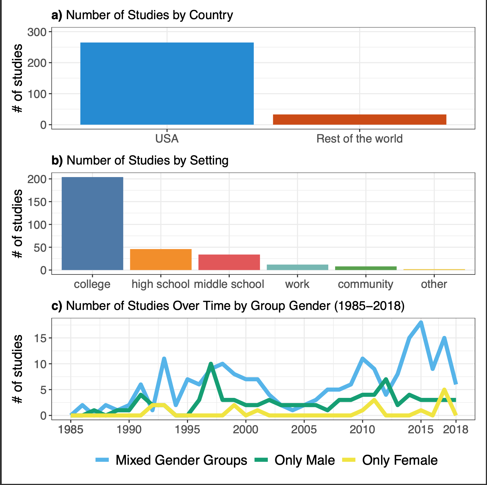
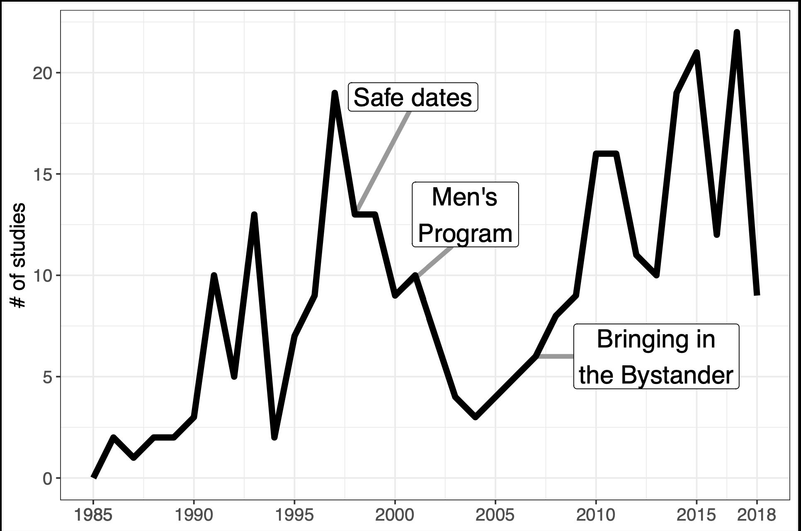
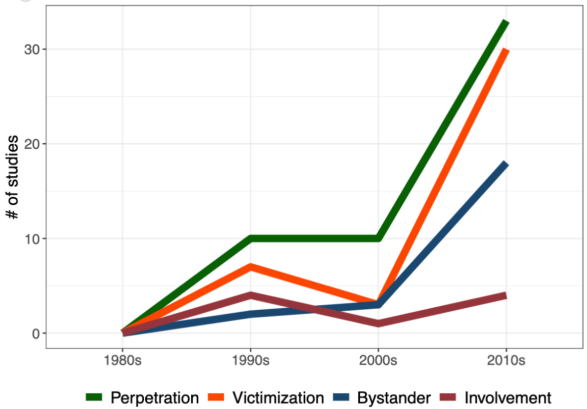
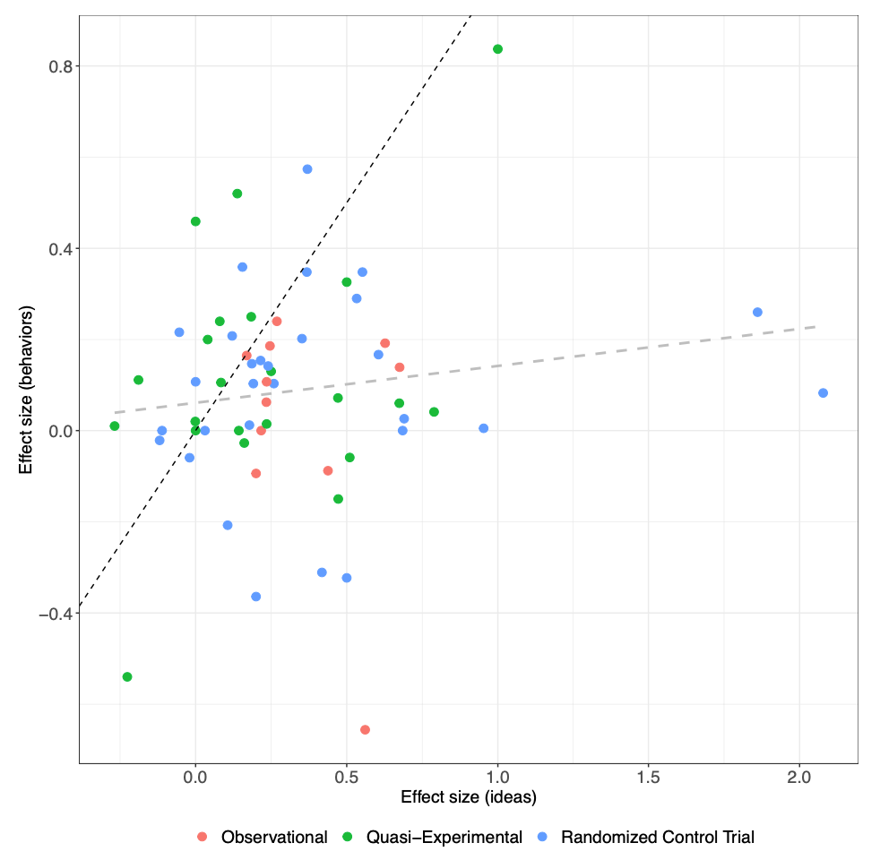

This research report summarizes a new meta-analysis: [Preventing Sexual Violence —A Behavioral Problem Without a Behaviorally-Informed Solution](https://osf.io/preprints/psyarxiv/xgbzj), on which I am coauthor along with [Roni Porat](https://en.politics.huji.ac.il/people/roni-porat), [Ana P. Gantman](https://www.anagantman.com/), [John-Henry Pezzuto](https://twitter.com/john_pezzuto?lang=en), and [Elizabeth Levy Paluck](http://www.betsylevypaluck.com/).

The vast majority of papers try to change ideas about sexual violence and are moderately successful at that. However, on the most crucial outcomes — perpetration and victimization — the primary prevention literature has not yet found its footing. We argue that the field should take a more behavioralist approach and focus on the environmental and structural determinants of violence. 

## **The literature**

We surveyed papers written between 1986 and 2018 and found 224 manuscripts describing 298 studies, from which we coded 499 distinct point estimates. 

We looked specifically at [primary prevention](https://www.cdc.gov/violenceprevention/sexualviolence/rpe/index.html) efforts, which aim to prevent violence before it happens.  Methodologically, studies needed to have a control group to be included,  so no cross-sectional analyses or strictly pre-post designs.

We did not include 

-   [secondary prevention](https://www.cdc.gov/violenceprevention/pdf/svprevention-a.pdf), which deals with the aftermath of violence; 

-   anything where an impact on sexual violence was a secondary or unanticipated consequence of, e.g. giving [cash to women unconditionally](https://voxdev.org/topic/social-protection/unconditional-cash-transfer-programmes-and-intimate-partner-violence-kenya) or [opening adult entertainment establishments](https://academic.oup.com/ej/article-abstract/132/641/147/6309337); 

-   studies of especially high-risk populations, like sex workers or people who are incarerated; 

-   anything that sought to exclusively change the behavior of potential victims, e.g. [self-defense classes](https://compass.onlinelibrary.wiley.com/doi/full/10.1111/soc4.12597) or "[sexually assertive communication training](https://www.ojp.gov/ncjrs/virtual-library/abstracts/sexually-assertive-communication-training-acquaintance-rape)."  

These studies mostly take place on United States college campuses in mixed-gender settings.

{width="500"}

Here is the distribution of studies over time, with three "zeitgeist" programs highlighted.

{width="500"}

### **Three zeitgeists programs**

We identified three "pioneering and influential programs" that "represent the prevalent approaches to sexual violence prevention in a particular period of time."

The first is [[Safe Dates]{.underline}](https://psycnet.apa.org/record/1998-00238-005), which "makes use of multiple strategies, including a play performed by students, a poster contest, and a ten-session curriculum." Safe Dates starts from the assumption that perpetration and victimization can be reduced by changing dating abuse norms and gender stereotypes, as well as improving communication skills, e.g. anger management and conflict resolution.

The second is the [[Men's Program]{.underline}](https://www.degruyter.com/document/doi/10.2202/1949-6605.1684/html), which aims to prevent sexual violence by men by increasing their empathy and support for victims of sexual violence, and by reducing their resistance to violence prevention programs. In its initial form, participants watched a 15-minute dramatization of a male police officer who was raped by two other men, and then dealt with the aftermath. Participants then learned that the perpetrators “were heterosexual and known to the victim, and attempted to draw connections between the male police officer’s experience and common sexual violence experiences among women.” Participants then learned “strategies for supporting a rape survivor; definitions of consent;” how they might stop a peer from joking about rape or disrespecting women; and situations that were at high risk of sexual violence.

The third is [Bringing in the Bystander](https://onlinelibrary.wiley.com/doi/abs/10.1002/jcop.20159), which centers on helping people in danger (e.g. separating a drunk friend from a risky situation) and speaking up against sexist ideas. These interventions shift the goalposts a bit from decreasing perpetration behavior to increasing bystander behavior. It also categorizes all people as potential interveners, rather than casting men as potential perpetrators and women as potential victims.

### Outcome measurement

The vast majority of outcomes are self-reported. Perpetration and Victimization were measured with the [Sexual Experiences Survey](https://journals.sagepub.com/doi/10.1111/j.1471-6402.2007.00385.x) and ideas-based outcomes are typically measured with the [Illinois Rape Myth Acceptance Scale](https://doi.org/10.1037/t09511-000).

Perpetration, victimization, and bystander behaviors have become more popular outcomes over time.

{width="500"}

## Ideas-based approaches are dominant

Essentially every intervention we looked at tries to change *ideas* about sexual violence as a conduit towards reducing violence, and measures ideas as its main outcome.

The implicit model here is sometimes called KAP, or "[Knowledge, Attitudes, and Practice](https://www.ncbi.nlm.nih.gov/pmc/articles/PMC7750837/)." The typical measure of ideas is acceptance of rape myths ([Payne, Lonsway, & Fitzgerald 1999](https://psycnet.apa.org/doiLanding?doi=10.1037%2Ft09511-000)), which take four forms: "disbelief of rape claims, the belief that victims are responsible for rape, that rape reports are manipulation, and that rape only happens to certain kinds of women."

One study tries to alter physical environments in addition to ideas. [Taylor et al. (2013)](https://pubmed.ncbi.nlm.nih.gov/23076726/) deployed "a building-level intervention that included building-based restraining orders (“Respecting Boundaries Agreements”), posters to increase awareness of dating violence and harassment, and increased presence of faculty or school security in 'hot spots' identified by students." They evaluated this alongside "[Shifting Boundaries](https://ecsa.lucyfaithfull.org/shifting-boundaries)," a curriculum designed to reduce dating violence and sexual harassment among adolescents ages 11-13.

## Quantitative results

All results are presented in terms of Glass's ∆, an estimate of standardized mean difference. It takes the difference in average outcomes for the treatment and the control group and divides it by the standard deviation of the dependent variable for the control group. ∆ = 1.0 corresponds to a change of 1 standard deviation in the outcome. 

### An overall moderate effect

Our random effects meta-analysis reveals an overall effect size of ∆ = 0.28 (SE = 0.025). This effect is statistically significant at p \< 0.0001, and corresponds to a small to medium effect size by convention. We did not detect meaningful evidence of publication bias.

### Ideas are a lot easier to change than behaviors

The overall effect size for ideas-based outcomes is ∆ = 0.366 (SE = .031), p \< 0.0001; for behaviors, it's ∆ = 0.071 (SE = 0.022), p = 0.0015.

Moreover, things look worse when we subdivide behaviors into their four constituent categories: perpetration, victimization, bystander behaviors, and involvement. (Involvement outcomes measure participants’ interest in participating in sexual violence awareness and prevention activities.)

|               | N (studies) | Δ (SE)              |
|---------------|-------------|---------------------|
| Perpetration  | 53          | 0.033 (0.020)       |
| Victimization | 40          | 0.046 (0.029)       |
| Bystander     | 23          | 0.129\* (0.059)     |
| Involvement   | 9           | 0.236\* (0.088)     |
| Idea-based    | 264         | 0.366\*\*\* (0.031) |

\* *p \< .05; \*\*p \< .01; \*\*\*p \< .001.*

The effects on perpetration and victimization outcomes are neither clinically or statistically significant. In a forthcoming commentary to the paper, a leading scholar calls this a "damning wake-up call."

### Bystander efforts are generally ineffective

43 of 96 bystander studies measure behaviors. Twenty-two of those measured whether bystander interventions increase bystander behaviors, which they do to a modest extent ∆ = 0.154 (SE = 0.056), p = 0.011. In our database, twenty bystander studies measure perpetration or victimization, and had null effects on both perpetration (∆ = 0.019, SE = 0.019, p = 0.329) and victimization (∆ = -0.009, SE = 0.041, p = 0.835). This suggests, unfortunately, that nearly 1 in 3 studies in our database is pursuing a theory of change that does not meaningfully reduce sexual violence.

### Attitude change does not predict behavior change

Sixty-two studies measure both ideas-based and behavioral outcomes. For those studies, the pooled behavior change effect is ∆ = 0.083 (SE = 0.029), p = 0.006, while the pooled idea change effect is ∆ = 0.290 (SE = 0.039), p \<0.0001. Unfortunately, in these studies, we find a small, statistically non-significant correlation of r(60) = 0.136, p = 0.293 between changes in ideas and changes in behaviors. The relationship remains small and non-significant when looking solely at randomized evaluations (r = 0.138, p = 0.48). Basically, changing ideas does not appear sufficient for changing behaviors. 

This figure displays this lack of relationship:

{width="500"}

Each point in the figure represents a study that measures both ideas and behaviors, with the average effect size for ideas about sexual violence (within a given study) on the X axis and the average within-study behavioral effect size on the Y axis. The dotted black line shows what a correlation of 1.0 would look like, and the dotted gray line shows the correlation that we actually observe. Studies are color-coded by design.

# Where do we go from here?

### Environmental and structural theories of change are relatively untested

From the paper:

> [W]e do not currently have many approaches that aim to solve the problem of sexual violence with interventions that target behavior change. Instead, we see predominantly efforts to change attitudes, beliefs, norms, and knowledge surrounding sexual violence with the assumption that behavior change will follow.
>
> ...Interventions that take a behavioral approach may do so by considering features of the environment. Physical spaces communicate local norms and expectations ([Gantman & Paluck, 2022;](https://dx.doi.org/10.1177/17456916211030264) [S. McMahon et al., 2022](http://dx.doi.org/10.1177/26320770221093641)) as well as make some behaviors easier than others to enact. Those features could be geographical configurations like a lack of common social space ([Gantman & Paluck, 2022)](https://journals.sagepub.com/doi/10.1177/17456916211030264)...Another idea that is more relevant to the college setting is based on the finding that college students do not have enough private spaces to interact that are not bedrooms ([Hirsch & Khan, 2020](https://www.sexualcitizens.com/)). Therefore, future work could quantitatively evaluate the impact of introducing more public spaces to reduce sexual violence on campus. Interventions may also consider who is afforded power in a given situation: For example, who owns the physical space, who has more money, who is driving home, and how the physical space communicates who is valued ([Gantman & Paluck, 2022](https://journals.sagepub.com/doi/10.1177/17456916211030264)). For example, fraternities with poorly kept women’s restrooms were also places where sexual violence was more likely to occur ([Boswell & Spade, 1996](https://www.jstor.org/stable/189830)). We recommend a focus on geographical and other aspects of physical spaces as one untapped area for future theorizing and intervention programming that targets behavior change.

The [Taylor et al. (2013)](https://pubmed.ncbi.nlm.nih.gov/23076726/) school-based intervention I mentioned earlier is one of the most effective interventions we looked at, and a great candidate for large-scale replication.

### A few interventions that aren't primary prevention efforts came out looking comparatively effective 

[Unconditional cash transfers to women meaningfully reduces sexual violence in rural Kenya.](https://www.nber.org/system/files/working_papers/w25627/revisions/w25627.rev0.pdf)

So does decriminalizing sex work (in [Rhode Island](https://academic.oup.com/restud/article-abstract/85/3/1683/4756165) and [the Netherlands](https://www.aeaweb.org/articles?id=10.1257/pol.20150299)).

Ditto for [opening adult entertainment establishments in NYC](https://www.micaelasviatschi.com/wp-content/uploads/2020/06/sex_cr_5_27_20.pdf).

### Some recent methodological innovation in measurement

We write:

> We suggest researchers attempt to triangulate on rates of perpetration and victimization through multiple avenues of measurement. When testing interventions conducted in a college campus, researchers can collect complaints filed with the University’s Title IX offices, crime data observed by police on campus grounds, and self-reports of perpetration and victimization...
>
> It is also possible to better assess the relationship between changing ideas about sexual violence and changing behavior. For example, [Sharma (2022)](https://www.povertyactionlab.org/sites/default/files/TSH_latest.pdf) tests a sexual harassment training aimed at men in India, and uses an innovative mix of women reporting on harassment behaviors of men in their class, trust games, direct questions and hypothetical scenarios to elicit opinions. Lastly, [Schuster, Tomaszewska, and Krah ́e (2022)](https://www.tandfonline.com/doi/full/10.1080/00224499.2022.2105290) combine self-reported behavioral data at multiple timepoints with “risky sexual scripts” and open-ended questions to provide a fuller picture of how and when ideas about sexual violence and sexual violence itself vary together.

### There are not a lot of cost-benefit-analyses in this literature

The one cost-benefit analysis that comes to mind is of the [SASA! program in Uganda](https://link.springer.com/article/10.1186/s12916-014-0122-5), which estimated they could [prevent a single instance of IPV for \$486 on average](https://link.springer.com/article/10.1186/s12889-016-2883-6?fromPaywallRec=false). We do not place much credence in this finding because the study had just 4 clusters in treatment and 4 in control. However, for folks working in this field, this is probably a good baseline estimate.

If a funder asked me about best current opportunities, I would say we need more basic research, i.e. randomized evaluations of the sorts of behavioral interventions we propose.

# **Further reading and supplementary materials**

I got a lot out of [Sexual Citizens](https://www.amazon.com/Sexual-Citizens-Landmark-Assault-Campus/dp/1324001704), which is an anthropology of sexual violence at Columbia University. Here is a very nice [Jia Tolentino](https://www.newyorker.com/magazine/2018/02/12/is-there-a-smarter-way-to-think-about-sexual-assault-on-campus) article on the same subject.

Code and data are on [GitHub](https://github.com/setgree/sv-meta) and also [Code Ocean](https://doi.org/10.24433/CO.5471833.v1).

[I also posted this on the [Effective Altruism forum.](https://forum.effectivealtruism.org/posts/uWh8N5DtbSLsuuTzL/research-report-meta-analysis-on-sexual-violence-prevention)]
