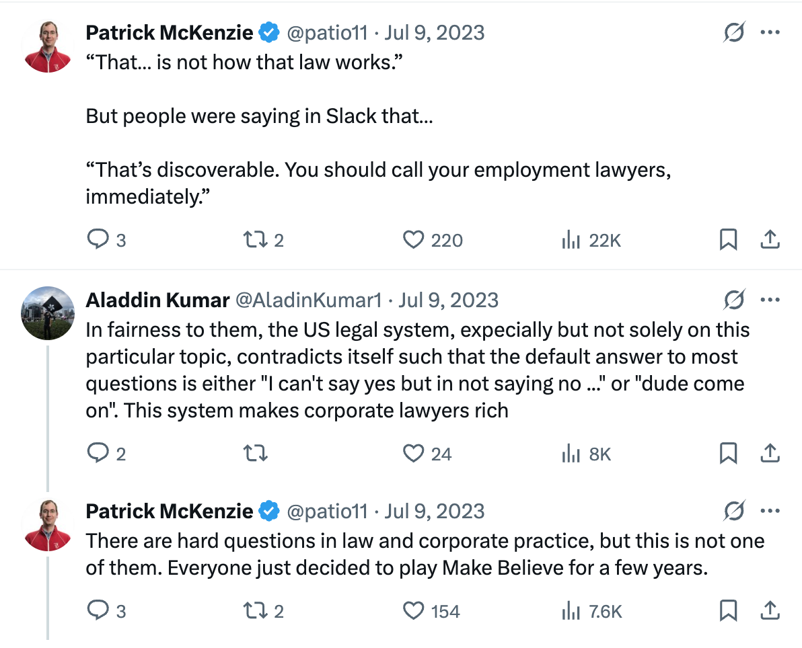

In the news:

> [White House Cancels \$400 Million in Grants and Contracts to Columbia](https://www.nytimes.com/2025/03/07/nyregion/trump-administration-columbia-grants-cancelled-antisemitism.html)
>
> [Columbia Agrees to Trump’s Demands After Federal Funds Are Stripped](https://www.nytimes.com/2025/03/21/nyregion/columbia-response-trump-demands.html){.uri}
>
> [Columbia President Is Replaced as Trump Threatens University’s Funding](https://www.nytimes.com/2025/03/28/us/columbia-universitys-president-resigns.html)

At my local cafe last week, some incensed folks asked: why didn't Columbia have more courage? Why couldn't the Ivy League band together and mount a hearty legal defense?

I think [\@patio11](https://x.com/patio11) has the [right answer here](https://x.com/patio11/status/1678235882481127427):

I'd take essentially any odds on a wager that at some point in the past 10-15 years, some high-level Columbia folks wrote, in their work emails, things that have been deemed unconstitutional in light of [*Students for Fair Admissions v. Harvard*](https://en.wikipedia.org/wiki/Students_for_Fair_Admissions_v._Harvard). I doubt Columbia is scared of SFA, but I bet they're scared of the DOJ. I'd bet that some attorneys there would love to initiate FBI raids in a "[how do you like it](https://www.businessinsider.com/melania-trump-violated-new-underwear-mar-a-lago-raid-report-2022-9)?" spirit. I don't think the Columbia administration [would be looking at jail time](https://www.justice.gov/crt/statutes-enforced-criminal-section#:~:text=committed%20by%20others.-,A%20violation%20of%20the%20statute%20is%20a%20misdemeanor,-%2C%20unless%20prosecutors%20prove), but honestly, who knows?

If you had those kinds of skeletons, you'd probably fold too.

[Prompted by two conversations in the last week with folks who know a bit about the situation.]
