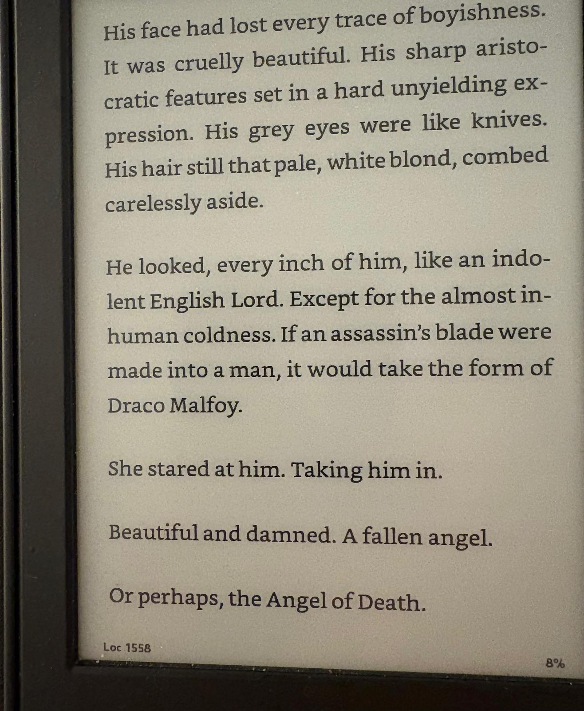

A friend is reading *Manacled*, already a [Romantasy classic](https://www.nytimes.com/2025/08/20/style/harry-potter-fan-fiction-romantasy-manacled.html), and shared this excerpt:

I react badly to so many things about this it's hard to know where to begin! (Probably with the use of 'aristocratic', shudder.) But I realized the next day that the excerpt was nagging at my attention. I think there's something I *do* like about this, which is that it's pulling at the dark threads of *Harry Potter —* charismatic psychopaths often being the best fleshed-out characters (Bellatrix), Rowling's obviously conflicted attitudes towards class and status in Britain, and the ways in which violence and attraction might go hand in hand ([Hermione slapping Draco in PoA](https://www.goodreads.com/quotes/182633-have-you-ever-seen-anything-quite-as-pathetic-said-malfoy)) — and seeing where they might go.

This particular journey is one I can't go on, alas. But noticing these undercurrents and swimming in them is a great way to start a fanfic, and writing fanfic is a wonderful leisure activity. (Way better than endless scrolling!) My [own efforts in this direction](https://archiveofourown.org/users/setgree/pseuds/S%20A%20G) basically started with frustration that no one in-universe noticed the gigantic strategic liability Voldemort opened when he tabooed his own name.[^1] Pulling on this thread went in a sadder, more grieving direction than I expected, and the book I came up with doesn't work. But it was a joy to write, and it started by pulling on the dark thread.

[^1]: In case we haven't talked about this: in *Deathly Hallows*, the Death Eaters set up a curse where anyone who says 'Voldemort' gets a visit from the goon squad, because members of the opposition, like Dumbeldore, ever say the name out loud in any context. Now imagine that an American wizard (who, because they're American, probably has a magic gun that shoot bullets around corners, and other such magical mayhem) discovers that he can summon his opponent's foot soldiers to any location he wants, anytime. I mean come on!

Likewise with my all-time favorite act of fanfiction, Team Four Star's [*Dragon Ball Z Abridged*.](https://www.youtube.com/playlist?list=PL6EC7B047181AD013) DBZA starts out very amateurish (which I don't mean as an insult) and juvenile (which I do). But at some point the production values go way up, and by the time we get to the Android saga, it's a much better show than DBZ ever was. And then comes the Cell saga, which I think is a masterpiece. In the original, 11-year-old Gohan discovers his hidden inner power and saves the day, and because the show is aimed at pre-teens, it doesn't interrogate this very deeply. But in DBZA, TFS noticed that what's actually happening on screen is that Gohan's father, Goku, manipulates events, and his son, to the point where Gohan has a [mental breakdown](https://www.youtube.com/watch?v=yGusek6nWHE) and goes on a murderous rampage. In the original, after it happens, he's silent. In DBZA — and this is one of my favorite scenes of any movie or TV show — [he says](https://www.youtube.com/watch?v=w__kXen0t9s):

> Cell. You don't get it. I *hate* this. The vibrations through my fists on contact. The taste of blood in my mouth. The sound of my heart in my ears. I *hate* it. I always have. But right now. in this moment. The only thing I hate more than *it*... is ***you***...Because you were right about me. I was a coward. Scared of what would happen if I snapped. Afraid that, if I lost it this time. I'd *never* come back. That I'd finally *kill* someone. But I'm not scared anymore, Cell. *Because there's no point in being afraid of the inevitable.*

Ah, Gohan, poor child. He just wanted peace. And what DBZA understands is that *Goku is the villain of this story*. Goku put him in this spot because he was trying to find a successor to his own role of guardian of the Earth. But Piccolo is the dad who actually loves Gohan, and he tries desperately to get Goku to [understand what's wrong with this plan](https://www.youtube.com/watch?v=T_OO3J7BbSg):

> **PICCOLO:** **GOHAN DOESN'T LIKE FIGHTING, YOU MORON!!**
>
> **GOKU:** *(in disbelief)* Whaaaat? Noooo... *(Gohan is still heard screaming in pain)* I mean... right?
>
> **PICCOLO:** Have you ever, in your life, actually asked your son what he likes?
>
> **GOKU:** Umm... but he went in that Chamber with me for that whole year.
>
> **PICCOLO:** Because he wanted to spend time with *you*--his *father*--the man who spends half his time training, and the other half *dead*! SOMETIMES **BOTH**!

I can see why people who aren't deep in DBZ nostalgia might not be able to grok the tragedy that's unfolding here through the haze of the silly show about aliens fighting other aliens to save the earth. But I see it. TFS pulled at the dark threads, and out came something Shakespearean about bad dads.

it is, obviously to me, more holy to create than to consume. Perhaps you already love a well fleshed-out fictional universe that's done the hard work to create characters and world. Did you notice that Neville's grandpa once dropped him out a third-floor window? That neither the Galactic Republic nor the Jedi Order was worth saving? That the goblins of *The Hobbit* really don't seem like such bad chaps? Pull those threads, I want to see what happens. (Who knows, perhaps you'll start a [nationwide craze](https://www.wsj.com/lifestyle/what-hot-dragon-riders-and-fornicating-faeries-say-about-what-women-want-now-23fc9e24?gaa_at=eafs&gaa_n=ASWzDAgiQFm60z9xqPkpPsJfQBkV-eui2JxTqwdlJDMOTnjfW2temI-wmpAUpPUWmCE%3D&gaa_ts=68d574b0&gaa_sig=8dj3UbuGWkjmgtPfNZa2hZTnwoMVSZKgnhN7d5h_ucRzxvrFvzeLdfftH08JCNe54GGkCUQzlv37HClTaKT4Tw%3D%3D) 😃)
